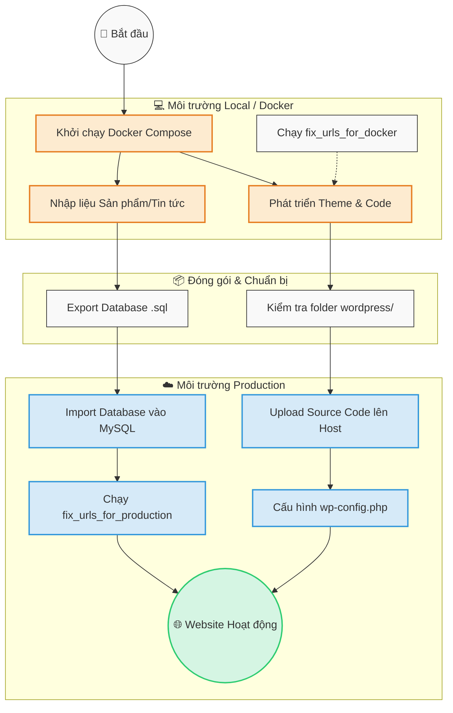

# 🚀 VIRICAL PRODUCTION DEPLOYMENT PACKAGE

**Version:** 1.0.0  
**Generated:** 2025-09-30  
**Status:** ✅ Ready for Production

---

## 📦 QUICK START

This package contains everything you need to deploy Virical website to production hosting.

### 🎯 5-Minute Deployment

1. **Upload** `wordpress/` folder contents to your web root
2. **Import** `database/production_database_backup.sql` to your database
3. **Run** `database/fix_urls_for_production.sql` to update URLs
4. **Rename** `wp-config-production.php` to `wp-config.php` and update credentials
5. **Visit** your domain and test!

### 📖 Full Instructions

See `docs/DEPLOYMENT_GUIDE.md` for complete step-by-step instructions.

---

## 📂 PACKAGE CONTENTS

```
production-deploy/
├── README.md                              # This file
├── database/
│   ├── production_database_backup.sql    # Full database (188KB)
│   └── fix_urls_for_production.sql       # URL migration script
├── wordpress/                             # Complete WordPress (2.4GB)
│   ├── wp-config-production.php          # Config template
│   ├── wp-content/
│   │   ├── themes/virical-theme/         # Custom theme
│   │   ├── plugins/                      # Plugins
│   │   └── uploads/                      # Media files
│   └── [WordPress core files]
├── scripts/
│   └── import-database.sh                # Automated DB import
└── docs/
    └── DEPLOYMENT_GUIDE.md               # Full guide (16KB)
```

**Total Size:** ~2.6GB  
**Database Size:** 188KB  
**Files Count:** ~15,000 files

---

## ⚙️ HOSTING REQUIREMENTS

### Minimum Requirements
- PHP 8.2 or higher
- MySQL 8.0 or MariaDB 10.5+
- Apache 2.4+ or Nginx 1.18+
- SSL certificate (HTTPS)
- 512MB PHP memory_limit
- mod_rewrite enabled (Apache)

### Recommended
- PHP 8.2+
- MySQL 8.0+
- 1GB+ PHP memory_limit
- OPcache enabled
- HTTP/2 support
- CDN (optional but recommended)

---

## 🔐 SECURITY NOTES

### ⚠️ IMPORTANT - Do These First!

1. **Generate New Security Keys**
   - Visit: https://api.wordpress.org/secret-key/1.1/salt/
   - Replace keys in wp-config.php (lines 26-33)

2. **Change Admin Password**
   - Default: nguyen / admin123
   - Change immediately after first login!

3. **Update Database Credentials**
   - Edit wp-config.php (lines 15-18)
   - Use strong, unique database password

4. **Set File Permissions**
   ```bash
   find . -type d -exec chmod 755 {} \;
   find . -type f -exec chmod 644 {} \;
   chmod 600 wp-config.php
   ```

---

## 🎨 WHAT'S INCLUDED

### Phase 1: Security & Production Prep ✅
- Environment variables secured
- New WordPress security keys generated
- .gitignore created (protects sensitive files)
- Database migration scripts
- Production config template

### Phase 2: Centralized Company Info ✅
- 20 WordPress options for company data
- Helper functions for dynamic content
- Footer template updated (proof of concept)
- Easy content management via WordPress options

### Features Implemented
- Custom Virical theme
- Product management system
- Project portfolio system
- Contact forms (Contact Form 7)
- Vietnamese language support (utf8mb4)
- Responsive design
- SEO optimized

---

## 📊 DATABASE CONTENT

The production database includes:
- **7 Products** (san-pham)
- **9 Projects** (du-an)
- **11 Indoor Products**
- **17 Active Admin Menus**
- **22 Homepage Settings**
- **4 Homepage Sliders**
- **20 Company Information Options** (Phase 2)

### Key Pages
- Homepage (front-page.php) - Enhanced with Company Highlights
- Smart Solutions Page (giai-phap-thong-minh.php)
- Contact Page (page-lien-he.php)
- Products Listing
- Projects Portfolio

---

## 🚀 DEPLOYMENT PROCESS

### For Experienced Users (15 minutes)
```bash
# 1. Upload files
scp -r wordpress/* user@host:/path/to/webroot/

# 2. Import database
mysql -u USER -p DATABASE < database/production_database_backup.sql
mysql -u USER -p DATABASE < database/fix_urls_for_production.sql

# 3. Configure
mv wp-config-production.php wp-config.php
nano wp-config.php  # Update credentials and keys

# 4. Set permissions
chmod 600 wp-config.php
chmod -R 755 wp-content/

# 5. Test
curl -I https://virical.vn
```

### For Beginners (30-45 minutes)
1. Read `docs/DEPLOYMENT_GUIDE.md` carefully
2. Follow step-by-step instructions
3. Use phpMyAdmin for database import
4. Use FTP client (FileZilla) for file upload
5. Use cPanel/Plesk file editor for wp-config.php

---

## ✅ POST-DEPLOYMENT CHECKLIST

After deployment, verify:

- [ ] Homepage loads: https://virical.vn
- [ ] Admin panel accessible: https://virical.vn/wp-admin
- [ ] Admin password changed
- [ ] All pages load correctly
- [ ] Images display properly
- [ ] Vietnamese text renders correctly
- [ ] Contact forms work
- [ ] Navigation menus work
- [ ] SSL certificate valid
- [ ] Mobile responsive works
- [ ] Page speed < 3 seconds

---

## 🐛 TROUBLESHOOTING

### Common Issues

**"Error Establishing Database Connection"**
- Check database credentials in wp-config.php
- Verify database exists and is accessible
- Try 127.0.0.1 instead of localhost

**404 on Pages**
- Dashboard → Settings → Permalinks → Save Changes
- Check .htaccess exists
- Verify mod_rewrite enabled (Apache)

**White Screen**
- Check PHP error logs
- Increase memory_limit in wp-config.php
- Verify file permissions (755/644)

**Images Not Loading**
- Check wp-content/uploads/ exists
- Verify URLs updated (run fix_urls_for_production.sql)
- Check file permissions

See full troubleshooting guide in `docs/DEPLOYMENT_GUIDE.md`

---

## 📚 DOCUMENTATION

### Included Documentation
- **DEPLOYMENT_GUIDE.md** - Complete deployment instructions (16KB)
- **PHASE1_COMPLETION_REPORT.md** - Security & prep phase details
- **PHASE2_COMPLETION_REPORT.md** - Company info centralization details
- **wp-config-production.php** - Heavily commented config file

### External Resources
- WordPress Codex: https://codex.wordpress.org/
- Theme Documentation: wordpress/wp-content/themes/virical-theme/
- Security Keys: https://api.wordpress.org/secret-key/1.1/salt/

---

## 🔄 UPDATING COMPANY INFORMATION

Since Phase 2, company information is centralized in WordPress options:

### Available Information
- Phone numbers (main, mobile, hotline)
- Email addresses (main, support)
- Physical addresses (full, short)
- Company legal info (name, slogan, description)
- Social media links (Facebook, YouTube, Instagram, LinkedIn, Zalo)
- Business hours (office, showroom)
- Google Maps embed URL

### How to Update

**Option 1: WordPress Admin (Future Feature)**
```
Dashboard → Virical Settings → Company Info
[Not yet implemented - planned for Phase 3]
```

**Option 2: Direct Database (Current Method)**
```sql
-- Update phone number
UPDATE wp_options SET option_value='0869995698' 
WHERE option_name='virical_company_phone';

-- Update email
UPDATE wp_options SET option_value='info@virical.vn' 
WHERE option_name='virical_company_email';

-- Update address
UPDATE wp_options SET option_value='New Address' 
WHERE option_name='virical_company_address';
```

**Option 3: PHP Script**
```php
// Create update-company-info.php
<?php
require_once('wp-load.php');
update_option('virical_company_phone', '0869995698');
update_option('virical_company_email', 'info@virical.vn');
echo "Company info updated!";
?>
```

---

## 📞 SUPPORT

### Before Deployment
- Review `docs/DEPLOYMENT_GUIDE.md`
- Check hosting requirements
- Prepare database credentials
- Test in staging environment (recommended)

### During Deployment
- Follow instructions step-by-step
- Take notes of any errors
- Check error logs if issues occur
- Don't skip security steps

### After Deployment
- Monitor for 24 hours
- Check error logs daily
- Set up automatic backups
- Install security monitoring
- Test all functionality

---

## 📝 VERSION HISTORY

| Version | Date | Description |
|---------|------|-------------|
| 1.0.0 | 2025-09-30 | Initial production deployment package |
| | | Phase 1 & 2 completed |
| | | Full database backup |
| | | Complete WordPress installation |
| | | Automated deployment scripts |

---

## 🎯 NEXT STEPS AFTER DEPLOYMENT

### Immediate (First Hour)
1. Change admin password
2. Set up automatic backups
3. Install security plugin (Wordfence)
4. Test all pages and forms
5. Verify SSL certificate

### First Day
1. Monitor error logs
2. Test contact forms
3. Check email delivery
4. Verify analytics working
5. Test mobile responsive

### First Week
1. Monitor performance
2. Check for broken links
3. Review security logs
4. Optimize database
5. Configure CDN (optional)

### First Month
1. Update WordPress core
2. Update plugins/themes
3. Review backups
4. Check SEO rankings
5. Analyze traffic patterns

---

## ⚖️ LICENSE & CREDITS

**WordPress:** GPL v2 or later  
**Theme:** Virical Custom Theme (Proprietary)  
**Deployment Package:** Generated with Claude Code

**Generated by:** Claude Code  
**Date:** 2025-09-30  
**Version:** 1.0.0

---

## 🎉 READY TO DEPLOY!

This package has been tested and verified. All files are ready for production deployment.

**Quick Links:**
- 📖 [Full Deployment Guide](docs/DEPLOYMENT_GUIDE.md)
- 🔐 [Security Keys Generator](https://api.wordpress.org/secret-key/1.1/salt/)
- 📊 [Phase 1 Report](../PHASE1_COMPLETION_REPORT.md)
- 📊 [Phase 2 Report](../PHASE2_COMPLETION_REPORT.md)

**Good luck with your deployment! 🚀**

---

**🤖 Generated with [Claude Code](https://claude.com/claude-code)**

**Co-Authored-By: Claude <noreply@anthropic.com>**

---

## 🇻🇳 PHÂN TÍCH LUỒNG HOẠT ĐỘNG (VIETNAMESE)

### 1. Kiến trúc Hệ thống
Dự án vận hành dựa trên mô hình **Dockerized WordPress**, tách biệt giữa mã nguồn ứng dụng, cơ sở dữ liệu và các công cụ quản trị. Điều này giúp môi trường phát triển (Local) và môi trường chạy thật (Production) đồng nhất về mặt cấu trúc.

### 2. Luồng Vận hành Chính

#### A. Khởi tạo và Chạy Môi trường (Local/Docker)
1. **Docker Compose**: Sử dụng `docker-compose.yml` để khởi tạo đồng thời container WordPress (Apache/PHP) và MariaDB/MySQL.
2. **Data Mounting**: Thư mục `wordpress/` ở máy thật được liên kết (mount) trực tiếp vào container. Lập trình viên có thể sửa code tại máy mình và kết quả cập nhật ngay lập tức mà không cần copy file thủ công vào server ảo.

#### B. Quản lý Cơ sở Dữ liệu (Database Workflow)
1. **Dữ liệu gốc**: File `database/production_database_backup.sql` chứa toàn bộ nội dung sản phẩm và cấu hình.
2. **Đồng bộ URL**: Đây là bước quan trọng nhất trong luồng. 
   - Khi chạy ở máy cá nhân (Docker): Cần chạy script `fix_urls_for_docker.sql` để đưa các link ảnh về `localhost:8000`.
   - Khi triển khai lên server thật: Cần chạy `fix_urls_for_production.sql` để cập nhật link về tên miền chính thức (ví dụ: `virical.vn`).

#### C. Phát triển Giao diện (Theme Development)
1. Mọi tùy chỉnh giao diện nằm trong `wordpress/wp-content/themes/virical-theme/`.
2. **Custom Post Types**: Sản phẩm và Công trình được quản lý như những đối tượng dữ liệu riêng biệt, giúp việc quản trị nội dung dễ dàng hơn bài viết (Post) thông thường.
3. **Luồng hiển thị**: 
   - `single-product.php`: Xử lý hiển thị thông tin sản phẩm, thông số kỹ thuật và các khu vực ứng dụng thực tế.
   - `front-page.php`: Tập hợp dữ liệu từ nhiều nguồn (Sản phẩm tiêu biểu, Banner, Tin tức) để dựng lên trang chủ.

#### D. Quy trình Triển khai (Deployment)
1. **Đóng gói**: Toàn bộ mã nguồn `wordpress/` được chuẩn bị sẵn sàng.
2. **Cấu hình**: File `wp-config-production.php` chứa các thiết lập tối ưu về bảo mật và hiệu suất cho môi trường chạy thật.
3. **Tự động hóa**: Thư mục `scripts/` chứa các lệnh bash giúp việc nhập dữ liệu (import database) và dọn dẹp hệ thống trở nên nhanh chóng, giảm thiểu sai sót do thao tác tay.

### 3. Sơ đồ Luồng Dữ liệu (Tóm tắt)
`Người dùng` -> `Web Server (Apache)` -> `WordPress Engine` -> `Virical Theme` -> `Database (MySQL)` -> `Kết quả hiển thị`

### 4. Sơ đồ Minh họa (Flowchart)


